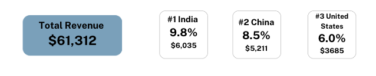
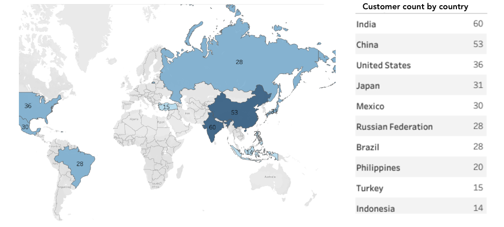
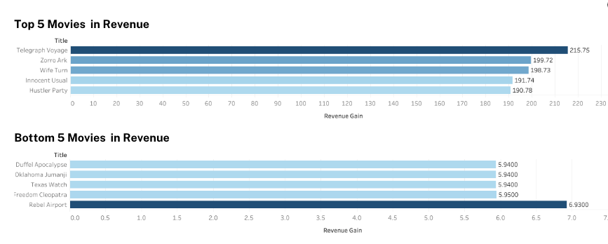

# Rockbuster Stealth: Data Analysis Project

## 📖 Project Overview
Rockbuster Stealth LLC is a global movie rental company planning to transition from physical rentals to an online video streaming platform to compete with established players like Netflix and Amazon Prime. This project aims to support the company's launch strategy through data-driven insights.

## 🎯 Objectives
- Identify which movies contribute the most and least to revenue.
- Analyze average rental durations for all videos.
- Determine the geographic locations of customers, including those with high lifetime value.
- Understand variations in sales figures across different regions.

## 📊 Data
The analysis is based on the following data sources:
- **Customer Data:** Demographic and geographic information.
- **Film Data:** Details of the movie catalog.
- **Rental & Payment Data:** Transactions and payment information.
- **Geographic Data:** Customer locations, including countries and cities.

The dataset was loaded into a PostgreSQL relational database management system (RDBMS) for querying and analysis.

## 🛠️ Approach
1. **Data Aggregation & Preparation:** SQL queries were used to extract and combine data from different tables.
2. **Statistical Analysis:** Patterns and trends in revenue and rental durations were analyzed.
3. **Geographic Insights:** Sales data was mapped to identify high-value regions.
4. **Data Visualization:** Insights were presented using Excel and Tableau for better stakeholder communication.

## ❓ Key Questions Addressed
- Which movies contributed the most/least to revenue?
- What was the average rental duration for all videos?
- Where are Rockbuster's customers located?
- Do sales figures vary between geographic regions?

## 💡 Insights and Recommendations
### Insights
1. **Top Revenue Markets:**
   - India, China, and the United States collectively contributed 24.3% of total revenue.
   - These regions are critical for targeted marketing efforts.
  
   

2. **Customer Behavior:**
   - The average rental duration for videos is 5 days, with a range of 3 to 7 days.
   - High-value customers are concentrated in key regions like India and China.
  
     

3. **Movie Performance:**
   - The top and bottom 5 movies had minimal impact on overall revenue, suggesting broader customer acquisition is more impactful than individual movie performance.
     

### Strategic Recommendations
- **Target High-Revenue Markets:** Focus on India, China, and the US with tailored campaigns.
- **Promote Popular Titles:** Highlight the top 5 revenue-generating videos in marketing campaigns.
- **Flexible Rental Policies:** Test features like flexible plans or limited free access for digital streaming.
- **Expand Customer Base:** Introduce referral programs and loyalty rewards.

## 📂 Deliverables
- SQL queries addressing the business questions.
- Data visualizations summarizing key insights.
- A professional presentation outlining the findings and recommendations.

## 🛠️ Tools and Technologies
- **Database:** PostgreSQL
- **Analysis Tools:** SQL, Excel, Tableau
- **Visualization:** Charts and dashboards to communicate findings effectively.

